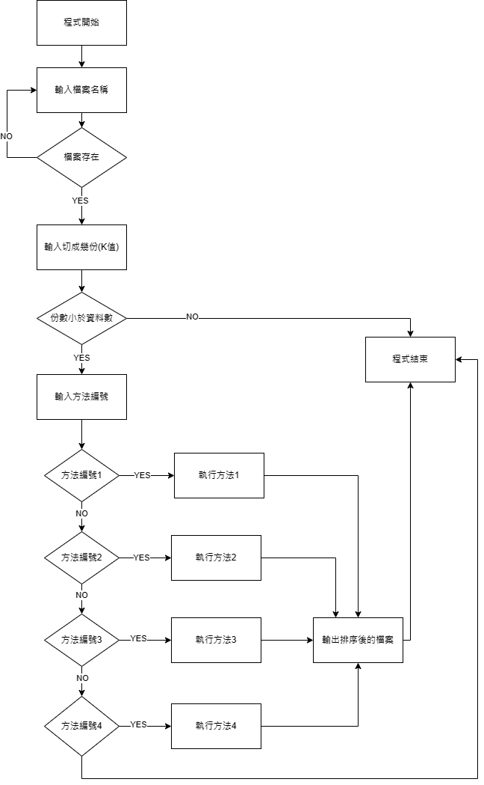

# High-Performance-Sorting-System-Parallel-Asynchronous-Computing-Analysis

一、	開發環境: VScode

二、	實作方法與流程:
執行流程: 

  方法一、對完整資料(沒有切割)進行泡沫排序。
  方法二、對切割後的資料，先進行泡沫排序，再做合併排序。
  方法三、
    對切割後的資料，multiprocessing.Pool(processes=k) 創建了一個有 k 個 process
    的 pool，pool.map(bubble_sort, partitions) 則將 bubble_sort 函數應用於
    partitions 列表中的每個元素，並 return 給 sorted_partitions。
    接下來是合併排序:
      1. 檢查 len(sorted_partitions) 是否大於 1(合併成一個了沒)
      2. next_partitions 來存儲合併後的分片。
      3. merge_pool，並設定進程數為 merge_processes。
      4. for 迴圈對已排序的分片進行兩兩合併，並將結果加到 next_partitions 中。
      5. 如果剩下一個未配對的分片，直接將其添加到 next_partitions 中。
      6. 將 sorted_partitions 更新為合併後的分片列表 next_partitions。
      7. 回到第一步，直到只剩下一個合併後的分片。
  方法四、
    sorted_partitions 來存放排序後的分片。for 迴圈遍歷每一份資料，各自創建一個
    thread 來執行泡沫排序，並將這些 thread 存放到 bubble_sort_threads 中。
    start()方法啟動每個泡沫排序thread，join()方法等待所有泡沫排序thread完成。
    接下來是合併排序:
      1.	檢查len(sorted_partitions) 是否大於1(合併成一個了沒) 
      2.	next_partitions 來存放下一輪合併後的分片。
      3.	使用 for 迴圈對已排序的分片進行兩兩合併，為每一對分片創建一個線程來執行合併，並將這些線程存放到 merge_threads 中。
      4.	如果剩下一個未配對的分片，直接將其添加到 next_partitions 中。
      5.	使用 join() 方法等待所有合併線程完成。
      6.	將 sorted_partitions 更新為合併後的分片列表 next_partitions。

      
三、結果與討論: (單位為秒)
表格一、
| K = 1	|  N = 1萬|    N = 10萬	|N = 50萬	    |N = 100萬 \n
| :--- | :--- | :--- |
|方法一 |9.906588	|3777.140625	|20408.09375	|89351.453125
|方法二	|10.415871|	3578.656215	|16349.90625	|84680.734375
|方法三	|9.979401 |1425.217013	|21112.15645	|94741.551389
|方法四	|10.092867|	3593.233521	|20333.02353	|85344.094893

