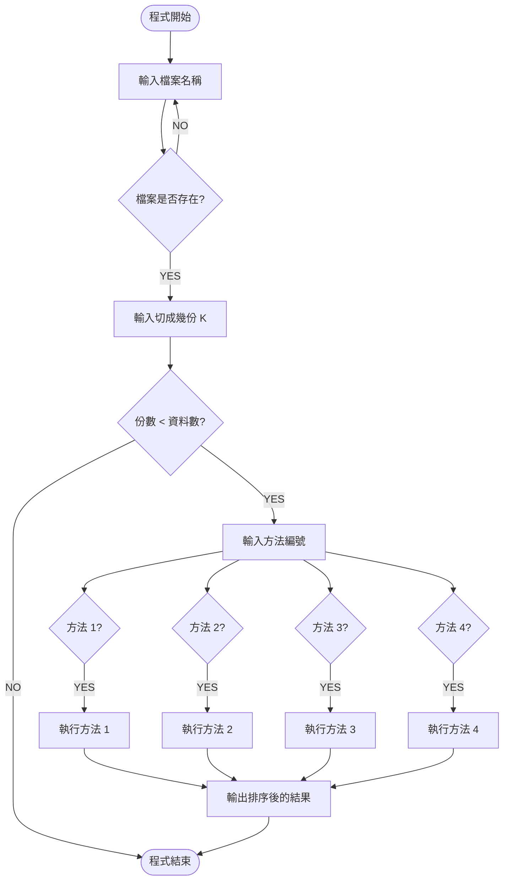

# High-Performance-Sorting-System-Parallel-Asynchronous-Computing-Analysis

# 排序演算法效能分析 (Multi-processing & Multi-threading)

本專案為旨在探討不同資料規模 ($N$) 與切割份數 ($K$) 下，單線程、多程序 (Multiprocessing) 與多線程 (Multithreading) 對排序效率的影響 。

## 🛠 開發環境
**編輯器**：Visual Studio Code (VScode) 

---

## 🚀 實作方法與執行流程

### 執行流程圖
本程式會先讀取資料夾內檔案，並根據使用者輸入的 $K$ 值切割資料，最後選擇排序方法執行 [cite: 3, 4, 6, 10, 14]。

## 方法說明

   方法一：對完整資料進行泡沫排序（無切割）。 

   
   方法二：將資料切割後，先分別進行泡沫排序，再做合併排序 。方法三 (Multiprocessing)：利用 multiprocessing.Pool 創建 $k$ 個進程並行            執行泡沫排序，最後進行兩兩合併排序直到完成 。 

   方法三 (Multiprocessing)：利用 multiprocessing.Pool 創建 $k$ 個進程並行執行泡沫排序，最後進行兩兩合併排序直到完成 。

   
   方法四 (Multi-threading)：為每一份切割資料創建一個 thread 執行泡沫排序，並使用 join() 等待所有線程完成後再進行合併排序 。

## 結果與討論: (單位為秒)

